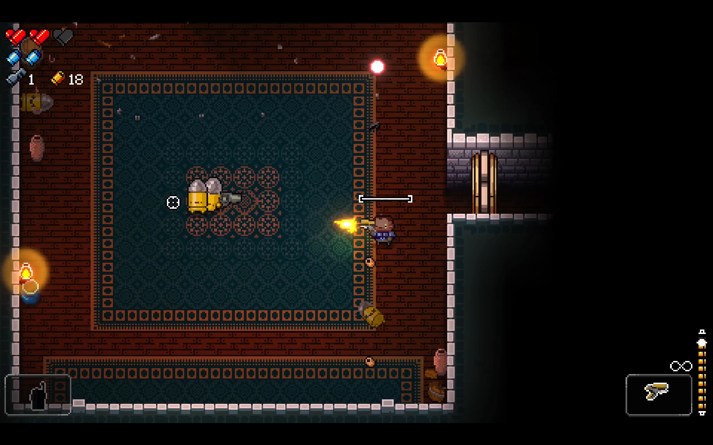
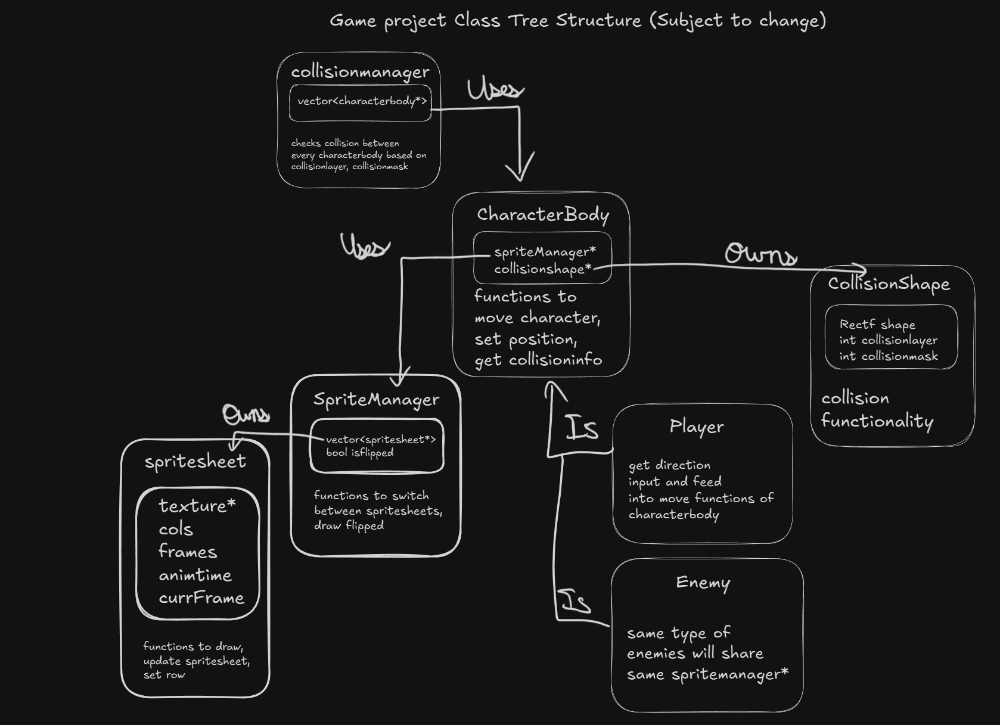

<!-- GENERAL GAME INFO -->

 

<h2 align="center">Enter The Gungeon</h2>

    Top-down roguelike bullet hell with cool dodging mechanics!
     
    <strong>Original game : </strong>
    <a href="https://store.steampowered.com/app/311690/Enter_the_Gungeon/"><strong>General info »</strong></a>
    ·
    <a href="https://youtu.be/yAnqij_MhQQ?si=GGZWfNYsgTyzLEOm"><strong>Youtube video »<strong></a>
     
     
  

<!-- TABLE OF CONTENTS -->

  
Table of Contents

  <ol>
    <li>
      <a href="#about-the-project">About The Project</a>
    </li>
    <li>
      <a href="#my-version">My version</a>
    </li>
    <li>
      <a href="#getting-started">Getting Started</a>
    </li>
    <li><a href="#how-to-play">How To Play</a></li>
    <li><a href="#class-structure">Class structure</a></li>
    <li><a href="#checklist">Checklist</a></li>
    <li><a href="#contact">Contact</a></li>
    <li><a href="#acknowledgments">Acknowledgments</a></li>
  </ol>

<!-- ABOUT THE PROJECT -->

## About The Project

<!--img title="" src="image1.png" alt="" width="575"-->

Here's why:

* Enter the gungeon is a fun 2D top-down roguelike that i personally enjoy playing and really like!
* While looking simple on the surface, it has a lot of mechanics and small tweaks that make it way more fun to play
* The project can easily be upscaled / downscaled based on the amount of time I have (varieties of guns, enemies, etc)

(<a href="#readme-top">back to top</a>)

## My version

This section gives a clear and detailed overview of which parts of the original game I planned to make.

### The minimum I will most certainly develop:

* Player movement and dodge-rolling
* 3 different types enemies with simple enemy AI
  * probably the bullet-head, shotgun-head and knight 
* Dynamic camera (adjusts itself according to where mouse is aiming)
* Health and currency (bullets)
* 2 dungeon rooms that spawn waves of enemies
* Shop room in between to buy health / gun with currency
* 2 different weapons

### What I will probably make as well:

* Keys 
* Blanks (blue icons below health) - powerups that can be used to clear all enemy bullets temporarily
* More rooms, weapons, enemies
* Chest room to use keys (Has a chest that gives random weapon/health/blank) 

### What I plan to create if I have enough time left:

* Effects and animations - making the game look good
* More dungeon rooms / random dungeon generation
* Items (thing in bottom left corner)
* Falling objects and environmental destruction (chandeliers)
* tables that can be flipped (not shown in video for scoping reasons)

(<a href="#readme-top">back to top</a>)

<!-- GETTING STARTED -->

## Getting Started

Detailed instructions on how to run your game project are in this section.

### Prerequisites

This is an example of how to list things you need to use the software and how to install them.

* Visual Studio 2022

### How to run the project

Explain which project (version) must be run.

* any extra steps if required 

(<a href="#readme-top">back to top</a>)

<!-- HOW TO PLAY -->

## How to play

Use this space to show useful examples of how a game can be played. 
Additional screenshots and demos work well in this space. 

### Controls

* keys, .. 
* .. 

(<a href="#readme-top">back to top</a>)

<!-- CLASS STRUCTURE -->

## Class structure

### Object composition

If you applied object composition (optional); explain where and how.

### Inheritance

Explain where you applied inheritance (mandatory).

### ..

(<a href="#readme-top">back to top</a>)

<!-- CHECKLIST -->

## Checklist

- [x] Accept / set up github project
- [ ] week 01 topics applied
  - [ ] const keyword applied proactively (variables, functions,..)
  - [ ] static keyword applied proactively (class variables, static functions,..)
  - [ ] object composition (optional)
- [ ] week 02 topics applied
- [ ] week 03 topics applied
- [ ] week 04 topics applied
- [ ] week 05 topics applied
- [ ] week 06 topics applied
- [ ] week 07 topics applied
- [ ] week 08 topics applied
- [ ] week 09 topics applied (optional)
- [ ] week 10 topics applied (optional)

(<a href="#readme-top">back to top</a>)

<!-- CONTACT -->

## Contact

Your Name - viresh.nambi.vijay.babu@student.howest.be

Project Link: [https://github.com/HowestDAE/gd14-Viresh-NambiVijayBabu](https://github.com/HowestDAE/gd14-Viresh-NambiVijayBabu)

(<a href="#readme-top">back to top</a>)

<!-- ACKNOWLEDGMENTS -->

## Acknowledgments

Use this space to list resources you find helpful and would like to give credit to. 

* [Example 1: cpp reference on std::vector](https://en.cppreference.com/w/cpp/container/vector)
* ..

(<a href="#readme-top">back to top</a>)

